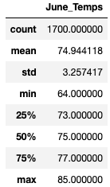
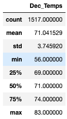

# surfs_up
Module 9 sqlite

### Overview
The intent of this analysis is to look at statistics for the temperature data from the island of O'ahu from some key months.  The concern has been that the weather would not allow for a surf and ice cream shop year round.  So in an attempt to address those concerns we pulled the statistics for the months of June and Decemeber or in other words, the beginning of Summer and the beginning of Winter.

### Results
For all of the results see the output images below.
- The mean temperature for June was 74.9 degrees with a low of 64 and a high of 85 using 1700 data points
- The mean temperature for December was 71.0 degrees with a low of 56 and high of 83 using 1517 data points
- The standard deviations were not that different for the two months with June having a standard devation of 3.26 degrees and December was 3.75.

### Summary
It would appear that O'ahu would be a viable location for a business catered towards surfing and ice cream.  The temperatures we see at the beginning of Summer and Winter don't differ all that much which would make both activities feasible year round.  Most imporantly is that the standard deviations are rather small for both months, and the mean temps for both months are in a comfortable range.

Some other queries that we could pull from our database and would be useful include:
- Re-running the code to get our temperature statistics but filter out any results from stations at higher elevations.  While not much more elevated, those stations wouldn't necessarily be the same as on the coast where our shop would be located.
- I think it would also be interesting to include not just the first month of Summer and Winter but at least a 3 month window while also potentially filtering out outliers.  This would allow us to get a clearer picture of the "normal" conditions of these seasons.

I also want to acknowledge that we are missing a very import piece of information, which is water temperature.  While this wouldn't necessarily effect ice cream sales, it could play a role in people wanting to surf, and those who do surf may be less likely to purchase ice cream if they have been in cold water.
